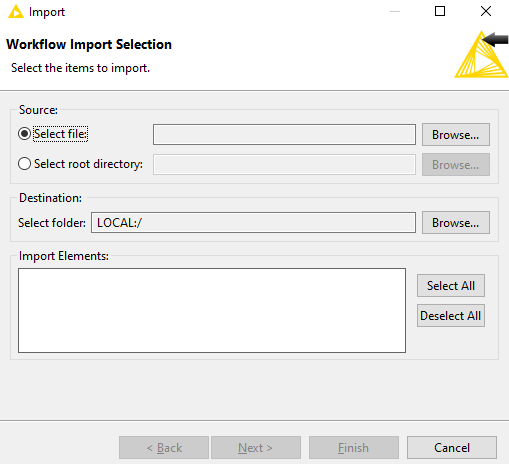
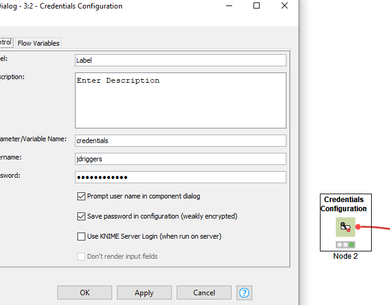
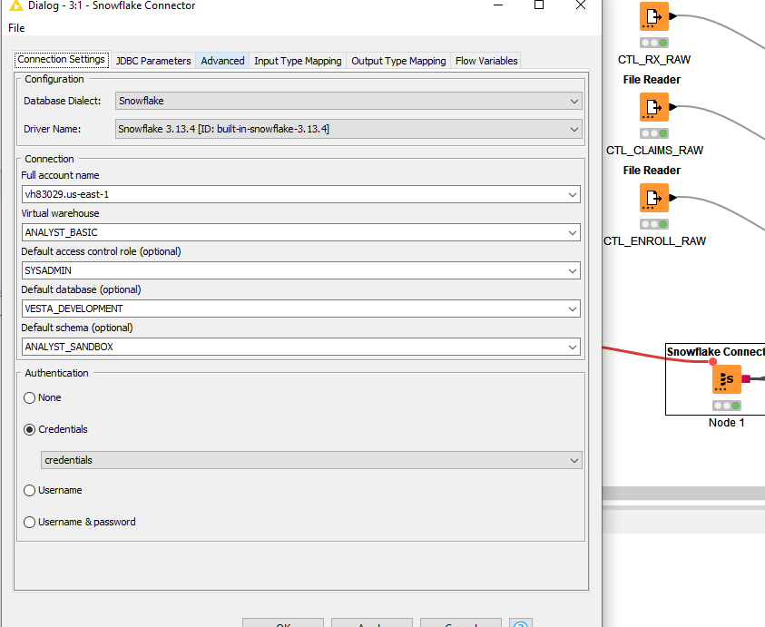
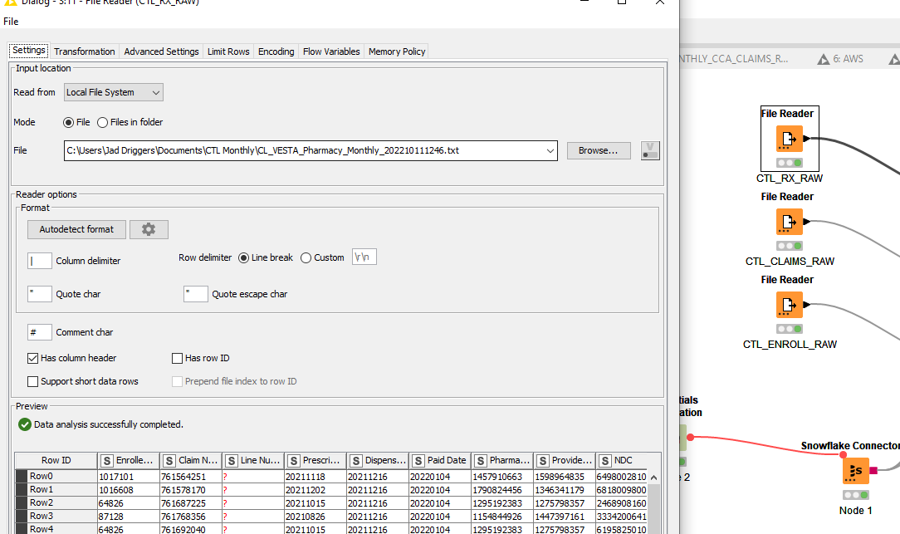

# CCA and CTL Monthly File Ingestion - Knime Workflow

These Knime workflows are a replacement/backup to the Python scripts. These Knime workflows are easier to setup,
configure and run for anyone who does not know Python.

## Install and Setup

* Download and
  install [Knime](https://www.knime.com/downloads?utm_term=knime&utm_campaign=Knime-Brand&utm_source=google&utm_medium=cpc&hsa_acc=2573270492&hsa_cam=18078963553&hsa_grp=140272583437&hsa_ad=618815534385&hsa_src=g&hsa_tgt=kwd-298177681876&hsa_kw=knime&hsa_mt=e&hsa_net=adwords&hsa_ver=3&gclid=Cj0KCQjwy5maBhDdARIsAMxrkw2tkeAYqC9pXnFDR0dn7ntLsCgXr0pfrsyv6ZaC7TLcmZiwKzOt3v4aAmLAEALw_wcB)_
  -pronounced NIME_
* Download the Knime-workspace folder from Github
* Once in Knime, go to File->Import Knime Workflow and point to your downloaded folder.

## Running Workflows

* **Double click "Credentials Configuration" node to enter your Snowflake Credentials**

* **Double click "Snowflake Connection" node and enter these settings**
* **Right click the node again and "Execute" or F7 to connect to Snowflake**
  

* Download the files needed from AWS S3 bucket.
* Double click the "File Reader" node and browse for the file. Do this for each file.
* Use the transformation tab to change data types
  