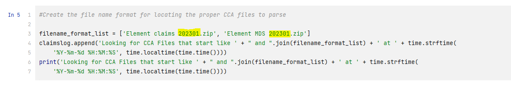

# CCA and CTL Monthly Files

CTL Python script was not completed by Matt. I resorted to using Knime as it was quicker. CCA Python script is complete and works fine. 
There is also a Knime script for CCA as backup. 

## CCA Monthly Claim Process
### Notes:
2 files are uploaded to hometeam-clinical-data/raw/cca. Files usually land around 10th-15th of the month. File naming convention is:
* Element claims yyyymm.zip (Example: Element claims 202301.zip)
* Element MDS yyyymm.zip

### Access
* AWS FTP folder <mark> hometeam-clinical-data </mark>
* Github https://github.com/vestahealthcare 

### Configuring Anaconda
* https://www.anaconda.com/
* https://docs.anaconda.com/anaconda/install/windows/

### Pull Repo
* https://github.com/vestahealthcare/analytics.git
### Python File Name
* Automating CCA Claims and MDS Files.ipynb
### Steps To Run Python Script
1. Open file
2. In Code block 5 change filename_format_list dates for the two files to match what's on S3
   
3. 